# Gamers Library
Gamers Library is a complete website with a database of games created for users to be able to share what games they have played with other gamers. The purpose of this is to allow users to not only view a library of games but also comment and like each game if they wish to, this allows the user to find like minded individuals, new games to play and to share their own experience with the games they've played.

## User Stories
One of the first things I did after deciding on what my project was to be able was to create some user stories to help figure out what functionality my website should have.

### As a User:
* As a Site User I can suggest a new game to be added so that I can share my favourite games with others.
* As a Site User I can view the games in the library so that I can find new games to play.
* As a Site User I can create an account so that I can interact with the site.
* As a Site User I can go to the next page so that I am not overwhelmed by content.
* As a Site User I can comment on games so that share my experience with that game to others.
* As a Site User I can like/unlike games so that I can interact with the content.
* As a Site User I can search using a filter so that I can find games similar to what I enjoy already.

### As an Admin:
* As a Site Admin I can approve game suggestions so that I can prevent games that don't exist from being added.
* As a Site Admin I can approve or delete comments so that the site remains a friendly environment.
* As a Site Admin I can create, read, update and delete games so that I can prevent duplicate games being added and remove games if necessary.

## Wireframes
Before I started any of the coding I first created some wireframes for how I envisioned the project to look.

### Home page
* For the home page I've gone with a relatively empty idea to prevent the user from being overwhelmed with information.
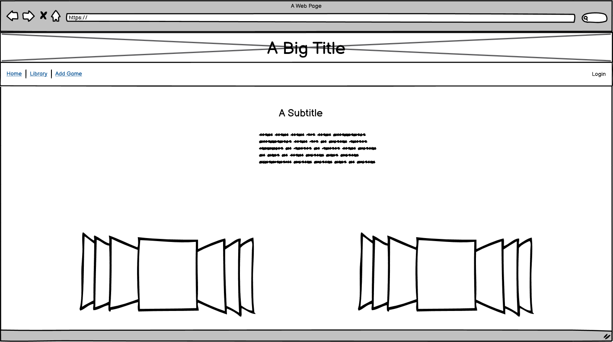

### Library page
* For the library page I'm aiming to create a page that shows only a few game posts with pagination to help prevent an overload of information.
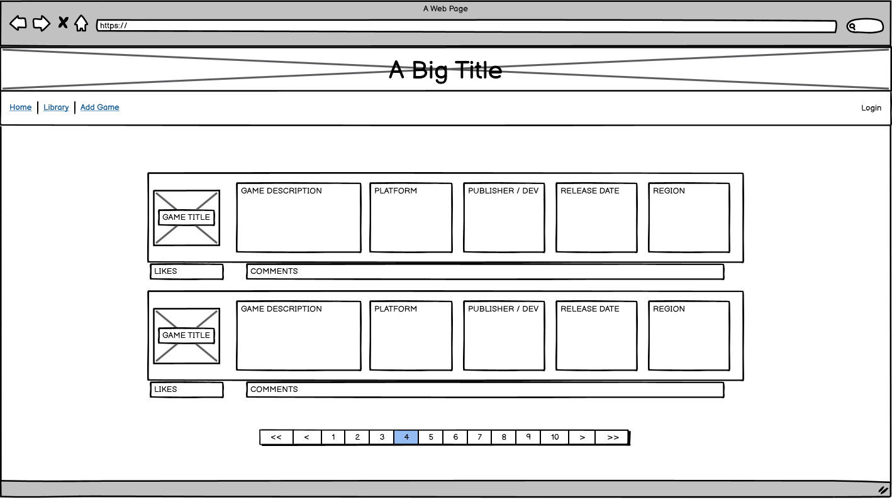

### Add game page
* The add game page is going to consist of a simple form that only shows once the user has logged in.
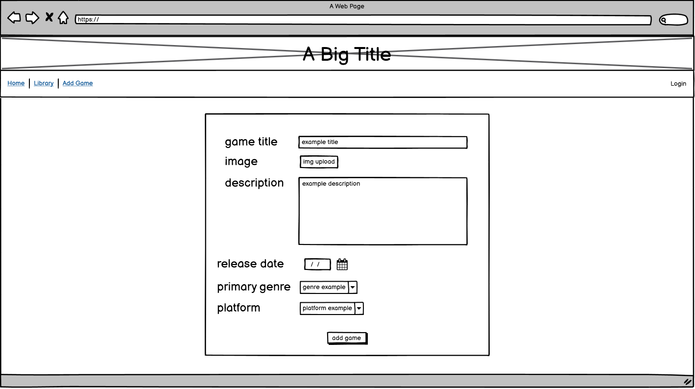

### Login page
* The login page will look similar to every other login page with an option for those without an account to register.
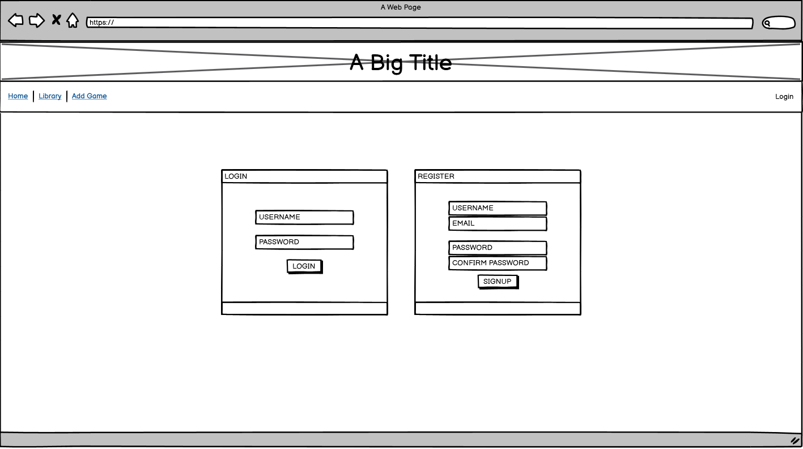

## Features

### Navigation Bar
* Simple navigation bar to help users traverse the pages.


### Welcome Text
* Small amount of welcome text along with a 'How it works' section to ensure users understand the concept of the website and it's goal.
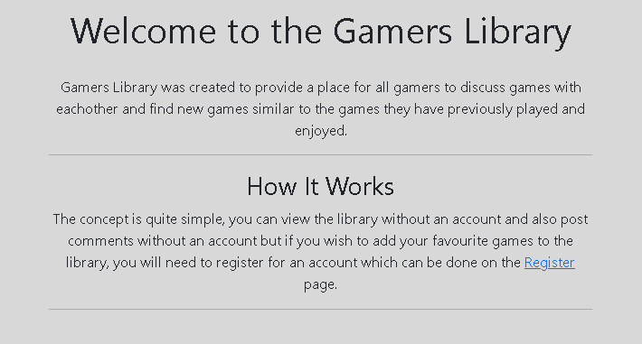

### Image Carousel
* Carousel found on the home page which shows the last 3-5 added games to the library.


### Table of Library Contents
* A table full of all added games to the database which users can look through, when the game title is clicked the user will be taken to a new page with the same details as the library but with an additional area for comments to be made.
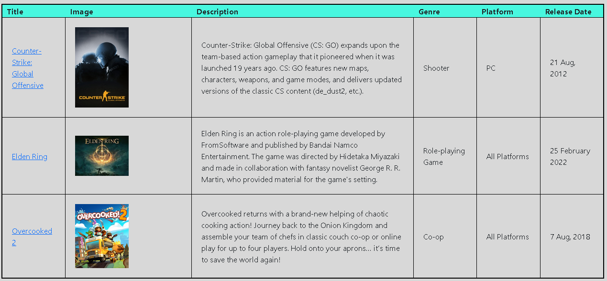

### Number of Items
* At the top of the library page there is a bit of text with the number of items currently in the library.


### Pagination
* The library page is the only page to have any pagination, within this pagination is the page number to help the user keep track of what pages the games they like were found on. The reason for paginating this page is to prevent the user from being overwhelmed with information.

    

    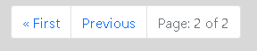

### Add Game Form
* Add game form which is only visible to users who have logged into an account, this allows the registered users to add their favourite games to the website.
* All posts will need to be approved by an admin before they show on the library page.
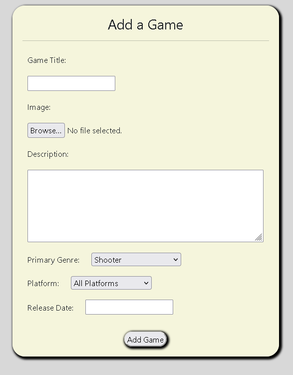

### Post Detail
* This page is broken down into 3 sections: Post details, Comments, Leave a comment.
* A page that is created for each game in the library for users to leave comments.
* This page also will have the post image and description.
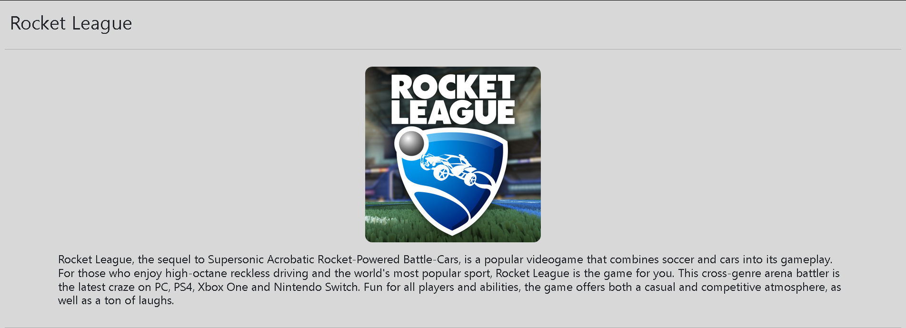


### Comments
* Comments on the post detail will have to be approved by admins to ensure the environment stays positive and healthy.
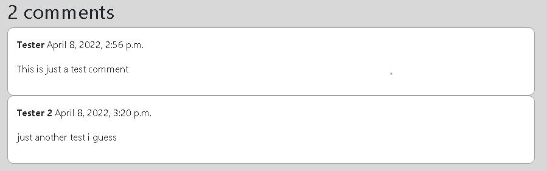

### Login
* A simple login page for users to access their accounts and redirects to the home page.
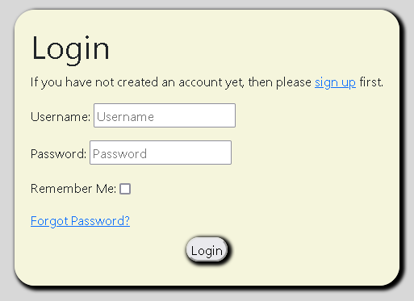

### Register
* A simple register page for users to create their accounts and redirects to the home page.
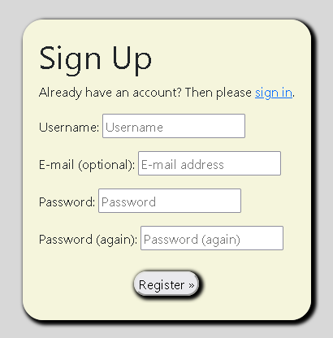

### Logout
* A simple logout screen that allows the user to logout of their account and redirects to the home page.
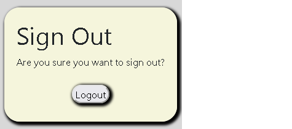

## Technologies Used
During this project I used multiple different technologies to help bring my idea to life, below is a list of the technologies used with a brief explanation.
* [Python](https://wiki.python.org/moin/FrontPage) - This language was used for the back end development.
* [Django](https://www.djangoproject.com/) - This was the Python framework I used to help create my project.
* [HTML](https://en.wikipedia.org/wiki/HTML) - I used HTML language to create the base/structure of the project.
* [CSS](https://en.wikipedia.org/wiki/CSS) - I used CSS language to style the overall website except for code taken from [Bootstrap](https://getbootstrap.com/).
* [Bootstrap](https://getbootstrap.com/) - I used bootstrap to import code and speed up the development process.
* [GitHub](https://github.com/) - GitHub is where all my code was stored and kept in one place.
* [Gitpod](https://www.gitpod.io/) - Gitpod is the environment in which I did all the coding and where the code was built.
* [Heroku](https://www.heroku.com) - Heroku was what I used to deploy the project.
* [Git](https://git-scm.com/) - Git is a free and open source version control system which I used for version control.
* [OBS Studio](https://obsproject.com/) - OBS is a recording/streaming software which I used to record myself doing the final test video for the project.

## Testing
All testing has been done and documented in the [TESTING.md](TESTING.md) file. 
This includes: 
* Video testing.
* Bugs.
* Validators.
* Browser Compatibility.

## Deployment
This project was deployed using Heroku.
* Steps for deployment:
    * Firstly, in Gitpod:
    * Install Django and gunicorn
         ```
        pip3 install Django==3.2 gunicorn
    * Install supporting libraries
        ```
        pip3 install dj_database_url psycopg2
    * Install Cloudinary Libraries
        ``` 
        pip3 install dj3-cloudinary-storage
    * Create requirements file
        ```
        pip3 freeze --local > requirements.txt
    * Create the Project
        ```
        django-admin startproject PROJ_NAME .
    * Create App
        ```
        python3 manage.py startapp APP_NAME
    * Navigate to the settings.py
    * Add to installed apps
        ```
        INSTALLED_APPS = [
            ...
            'APP_NAME',
        ]
    * Save file
    * In the terminal:
    * Migrate changes
        ```
        python3 manage.py makemigrations
        python3 manage.py migrate
    * Run server to test
        ```
        python3 manage.py runserver
    * Now we're ready to deploy navigate to the [Heroku](https://dashboard.heroku.com/) site
    * Sign up for a [Heroku](https://id.heroku.com/login) account, if you already have one just sign in.
    * Once logged into Heroku go to the dashboard.
    * Click on 'New' -> 'Create New App'.
    * Enter the app name and choose a region (for me this was gamers-library and Europe).
    * Click 'Create app'
    * Navigate to the Resources Tab, Add-ons, search and add 'Heroku Postgres'.
    * Navigate to the Settings Tab, click reveal Config Vars and copy the database url value.
    * In gitpod create a new env.py file.
    * Within the env.py file, import os.
    * Set environment variables for database url and add a secret key.
    * Go back to Heroku and add the Secret Key to the Config Vars.
    * Go back to gitpod to prepare our environment and settings.py file.
    * In settings.py Reference env.py i.e 
        ```
        from pathlib import Path
        import os
        import dj_database_url

        if os.path.isfile("env.py"):
            import env
    * Remove the default insecure Secret Key and replace with your own (links to the SECRET_KEY variable on Heroku)
        ```
        SECRET_KEY = os.environ.get('SECRET_KEY')
    * Comment out the old DataBases Section
    * Add new DATABASES Section (links to the DATABASE_URL variable on Heroku)
        ```
        DATABASES = {
            'default':dj_database_url.parse(os.environ.get("DATABASE_URL"))
        }
    * Save all files
    * Move to the Terminal and migrate changes
        ```
        python3 manage.py makemigrations
        python3 manage.py migrate
    * Navigate to the [Cloudinary](https://cloudinary.com/) website.
    * Create an account or login if you already have an account.
    * Navigate to the dashboard while on Cloudinary.
    * Find the 'API Environment variable'.
    * Copy the 'API Environment variable'.
    * Return to the env.py file.
    * Add Cloudinary URL to env.py file (be sure to paste in the correct section of the link)
        ```
        os.environ["CLOUDINARY_URL"] = "cloudinary://************************"
    * Return to Heroku.
    * Navigate back to the Config Vars.
    * Add Cloudinary URL to the Config Vars.
        ```
        CLOUDINARY_URL : cloudinary://************************
    * Add DISABLE_COLLECTSTATIC to Config Vars (temporary step for the moment, will be removed before final deployment)
        ```
        DISABLE_COLLECTSTATIC : 1
    * Add SITE_NAME to Config Vars
        ```
        SITE_NAME : gamers-library.herokuapp.com
    * Return to gitpod
    * In settings.py Add Cloudinary Libraries to installed apps.
        ```
        INSTALLED_APPS = [
            …,
            'cloudinary_storage',
            'django.contrib.staticfiles',
            'cloudinary',
            …,
        ]
        (note: order is important)
    * Tell Django to use Cloudinary to store media and static files (place under the Static files)
        ```
        STATIC_URL = '/static/'

        STATICFILES_STORAGE = 'cloudinary_storage.storage.StaticHashedCloudinaryStorage'
        STATICFILES_DIRS = [os.path.join(BASE_DIR, 'static')]
        STATIC_ROOT = os.path.join(BASE_DIR, 'staticfiles')

        MEDIA_URL = '/media/'
        DEFAULT_FILE_STORAGE = 'cloudinary_storage.storage.MediaCloudinaryStorage'
    * Link file to the templates directory in Heroku (place under the BASE_DIR line)
        ```
        TEMPLATES_DIR = os.path.join(BASE_DIR, 'templates')
    * Change the templates directory to TEMPLATES_DIR (place within the TEMPLATES array)
        ```
        TEMPLATES = [
            {
                ...,
                'DIRS': [TEMPLATES_DIR],
                ...,
                    ],
                },
            },
        ]
    * Add Heroku Hostname to ALLOWED_HOSTS
        ```
        ALLOWED_HOSTS = []
        host = os.environ.get('SITE_NAME')
        if host:
            ALLOWED_HOSTS.append(host)
    * In gitpod Create 3 new folders: media, static, templates
    * Create procfile on the top level directory: Procfile
    * In Procfile add:
        ```
        web: gunicorn PROJECT_NAME.wsgi
    * Save all files
    * In the Terminal:
        * Add : 
            ```
            git add .
        * Commit :
            ```
            git commit -m "Deployment Commit"
        * Push : 
            ```
            git push
    * Return to Heroku
    * Now return to the 'Deploy' page and find the 'Deployment method' section
    * Select 'GitHub' this should prompt you to login to your GitHub account
    * Once connected it will ask for a repository to connect to
    * Simply search the repository name, the repositroy should appear below
    * Click 'Connect'
    * From here you can choose either 'Manual deploy' or 'Automatic deploys'
    * To access the deployed link simply click the 'Open app' button located at the top right of your app page.

## Local Deployment
To make a local copy of this project, you can clone it by typing in your IDE terminal:
- `git clone https://github.com/GitHub-Harrison/gamers-library.git`

You will also need to:
* Create an [env.py](env_sample.py) (see for reference) file
* Within the file add:
    * The same Environment Variables
    * The same Config Vars (like on Heroku)
* You will also need to install the packages within the requirements.txt file
    ```
    pip3 install -r requirements.txt
Alternatively, if using Gitpod, you can click below to create your own workspace using this repository.

[](https://gitpod.io/#https://github.com/GitHub-Harrison/gamers-library)

## Credits

### Code Related Sources
Below are the sources that helped me develop my project as well as understanding the code I was writing and to help solve bugs/problems I encountered throughout the development.
| Source | Purpose |
| --- | --- |
| [StackOverflow](https://stackoverflow.com/questions/427102/what-is-a-slug-in-django) | Understanding 'slug' |
| [StackOverflow](https://stackoverflow.com/questions/18676156/how-to-properly-use-the-choices-field-option-in-django) | Choices Field |
| [StackOverflow](https://stackoverflow.com/questions/38388423/what-does-on-delete-do-on-django-models) | Understanding on_delete |
| [StackOverflow](https://stackoverflow.com/questions/2642613/what-is-related-name-used-for) | Understand related_name |
| [Django Documentation](https://docs.djangoproject.com/en/4.0/ref/models/options/) | Model Meta options |
| [Django Documentation](https://docs.djangoproject.com/en/4.0/ref/models/fields/#primary-key) | Model field reference |
| [Django Documentation](https://docs.djangoproject.com/en/4.0/topics/pagination/) | Pagination |
| [Grepper](https://www.codegrepper.com/code-examples/shell/how+to+recover+deleted+files+from+gitpod) | File Recovery |
| [Python Circle](https://pythoncircle.com/post/424/solving-django-error-noreversematch-at-url-with-arguments-and-keyword-arguments-not-found/) | Understanding 'NoReverseMatch at' |

### Content Related Sources
This website features materials protected by the Fair Use guidelines of the Copyright Act. All rights reserved to the copyright owners.