# Gamers Library Testing
Return back to the [README.md](README.md)

The testing process has been broken into two sections; one from a users point of view which focuses on how they might interact on the site and the other from an admins point of view and how they might check the site is function as expected.

## User Focused Testing
This section consists of all testing done regarding the users features and how a user might interact on the site.

### User Story Testing
Testing user stories required me to take a user first approach to the website and think solely about what a user would want to be able to do while on the site. Below are the user stories I Testing for (All testing can be found in the Final Testing Videos.):

* Pagination
* Viewing the Library
* Adding a Game
* [Account Creation](https://www.youtube.com/watch?v=UlrMBIEg5z8)
[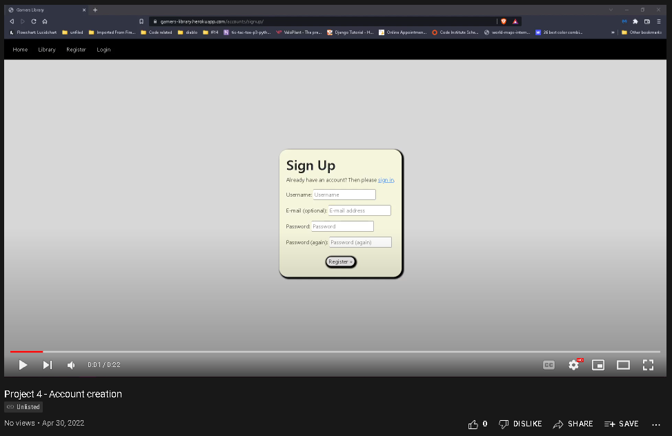](https://www.youtube.com/watch?v=UlrMBIEg5z8)
* [Commenting](https://www.youtube.com/watch?v=O0eHcAJg7H0)
[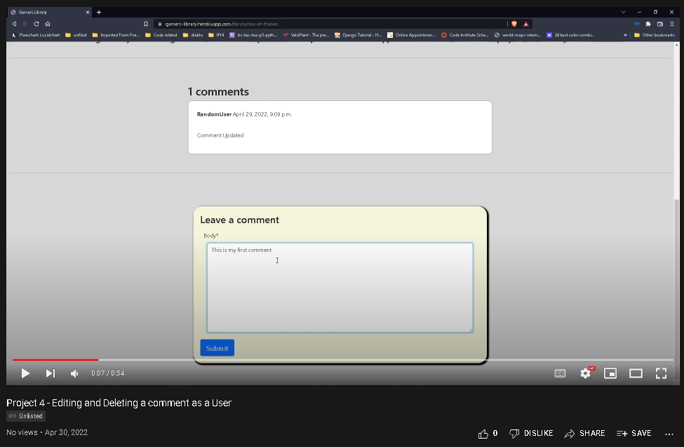](https://www.youtube.com/watch?v=O0eHcAJg7H0)

## Admin Focused Testing
This section focuses more on how an admin might interact with the site and what features they might use.

### Admin User Story Testing
Testing admin user stories required me to look at the site solely as an admin and to focus more on the admin page rather than the actual site. Below are the stories I tested for:

* Moderating the library
* Approving new games
* Approving/Removing comments

## Feature/Function Testing
I have manually tested this project by doing the following:
* Passed the code through different validators
* Testing all navigation and links work as intended
* Testing the user can submit a new game to be added
* Testing the user can create an account
* Testing the user can freely login/logout
* Testing the user can view the library
* Testing the pagination works correctly
* Testing the image carousel works correctly
* Testing each game has its own post detail page
* Testing the user can post comments on each games detail page
* Testing the admins can approve both games and comments

I also created a few tests within the project to help automate some of the process.

Below is a video from both the Admins and Users point of view.

## Final Testing Videos

## [Users Point of View](https://youtu.be/HkCbdaipWF0)
[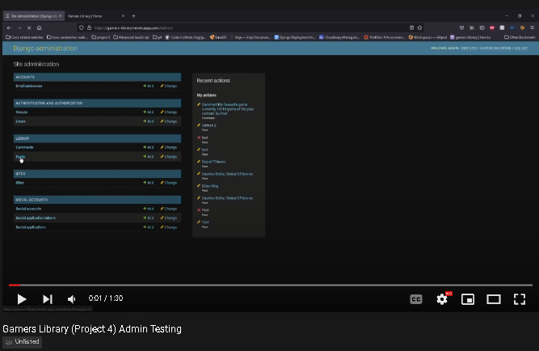](https://youtu.be/U_kbEO-b1B4)

## [Admins Point of View](https://youtu.be/SFvBN6OmioY)
[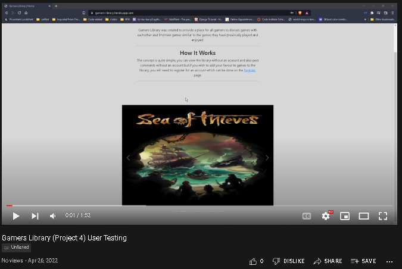](https://youtu.be/U_kbEO-b1B4)

## Bugs
While coding my project I have come across a few issues/bugs which I believe all have been fixed. I took note of some of the bugs through the GitHub issue tab and have linked them below.

### Solved Bugs
* One bug I encountered was a Syntax Error which was fixed by adding `` to the top of the file. - [**TemplateSyntaxError - Invalid block tag**](https://github.com/GitHub-Harrison/gamers-library/issues/11) Issue [#11](https://github.com/GitHub-Harrison/gamers-library/issues/11)
* Another bug I came across was one regarding "Reverse for 'PostDetail' not found", this was fixed by making several changes within my library/views.py, library/models.py and library/urls.py files. - [**Reverse for 'PostDetail' not found. 'PostDetail' is not a valid view function or pattern name**](https://github.com/GitHub-Harrison/gamers-library/issues/13) Issue [#13](https://github.com/GitHub-Harrison/gamers-library/issues/13)
* The simpliest bug I encountered was a 404 Page not found, this was due to a 'status' field I had in the model which has since been removed. [**Page not found - when clicking on a post from library.**](https://github.com/GitHub-Harrison/gamers-library/issues/14) Issue [14](https://github.com/GitHub-Harrison/gamers-library/issues/14)
* One bug I had which has been resolved was regarding IntergrityError, I have no memory of what was changed to resolve this issue. [**IntergrityError - null value in column "user_id" of relation "library_post" violates not-null constraint**](https://github.com/GitHub-Harrison/gamers-library/issues/15) Issue[15](https://github.com/GitHub-Harrison/gamers-library/issues/15)
* The final bug I documented was regarding 'column library_post.user_id does not exist' I have not seen this issue since so I believe this issue to be fixed. [**column library_post.user_id does not exist**]((https://github.com/GitHub-Harrison/gamers-library/issues/10)) Issue [#10](https://github.com/GitHub-Harrison/gamers-library/issues/10)

### Remaining Bugs
* Currently there are no bugs that I am aware of.

## Validator Testing

* PEP8
    * The only errors shown by the PEP8 Validator were relating to line too long as shown:

    
    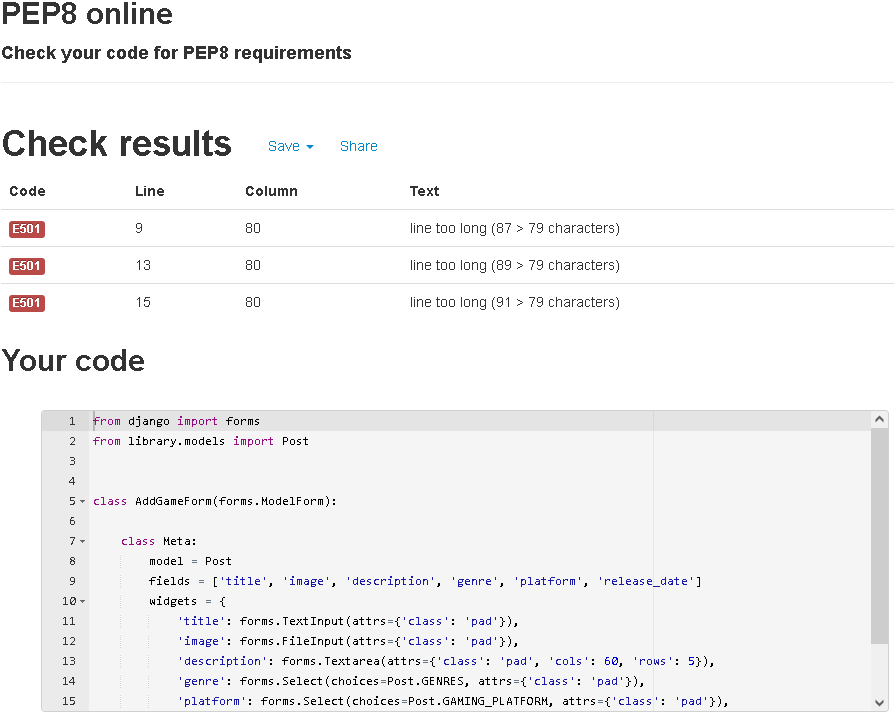

    * The rest of the python files came back with no errors:

    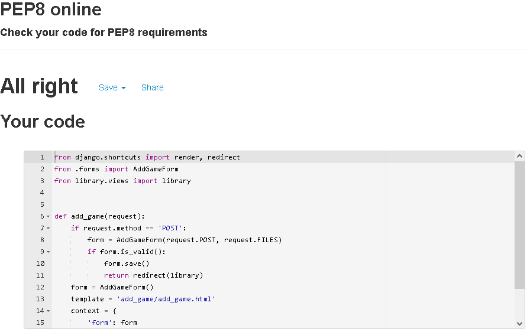
    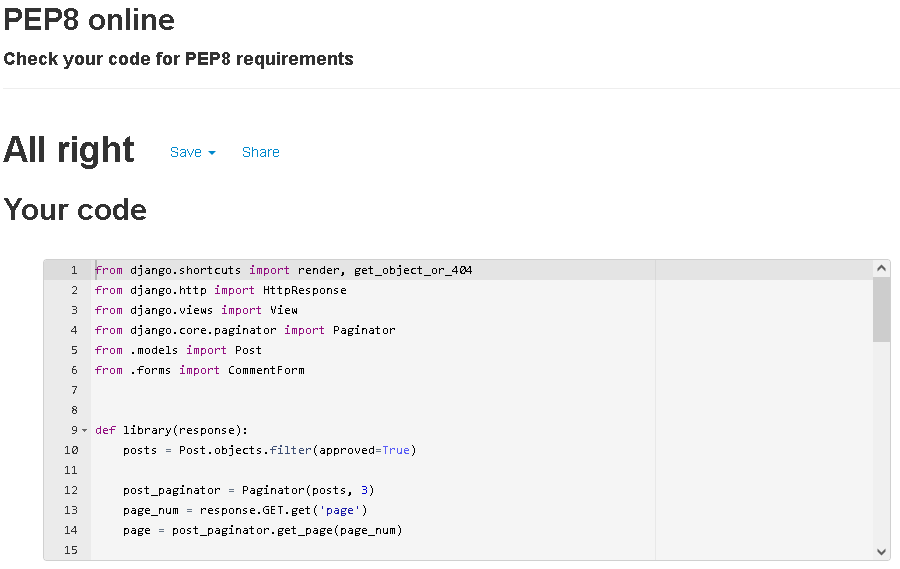
    
    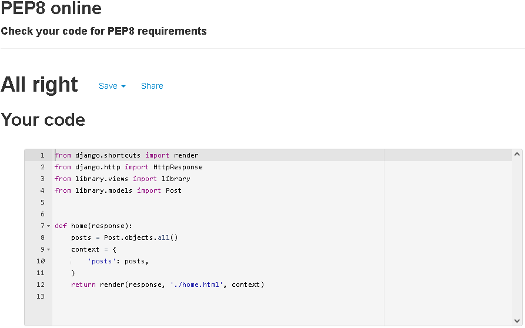

* HTML
    * The HTML files passed the [W3C Validator](https://validator.w3.org/nu/?doc=https%3A%2F%2Fgamers-library.herokuapp.com)
        
        
        
        
        
        
        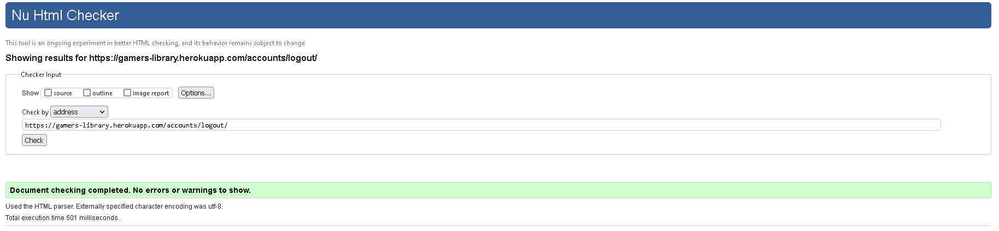

* CSS 
    * The CSS file passed the [W3C CSS Validator](https://jigsaw.w3.org/css-validator/validator) with no errors:
        

## Browser Compatibility

* Below are some screenshots of what the site looks like on different browsers/screensizes.

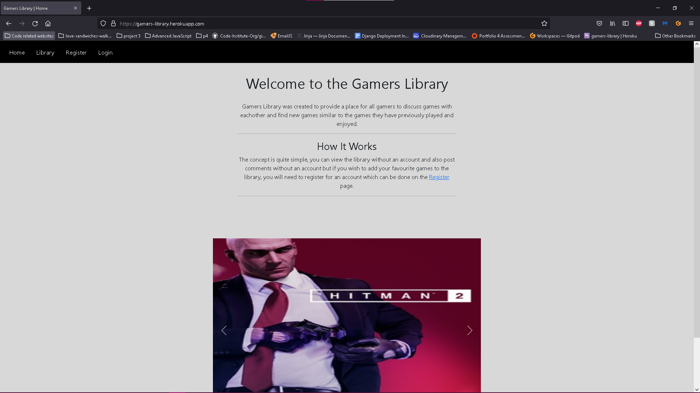
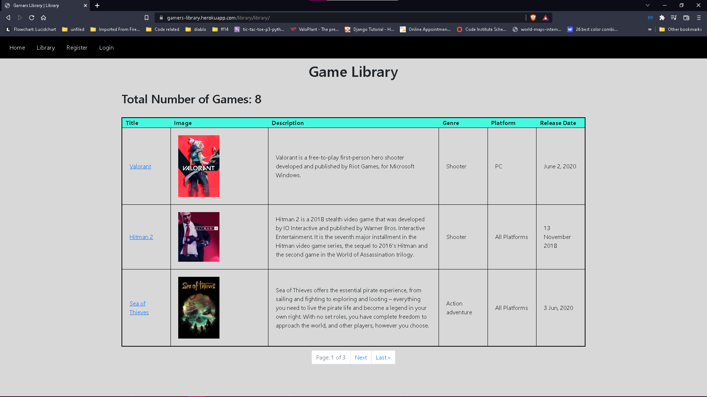
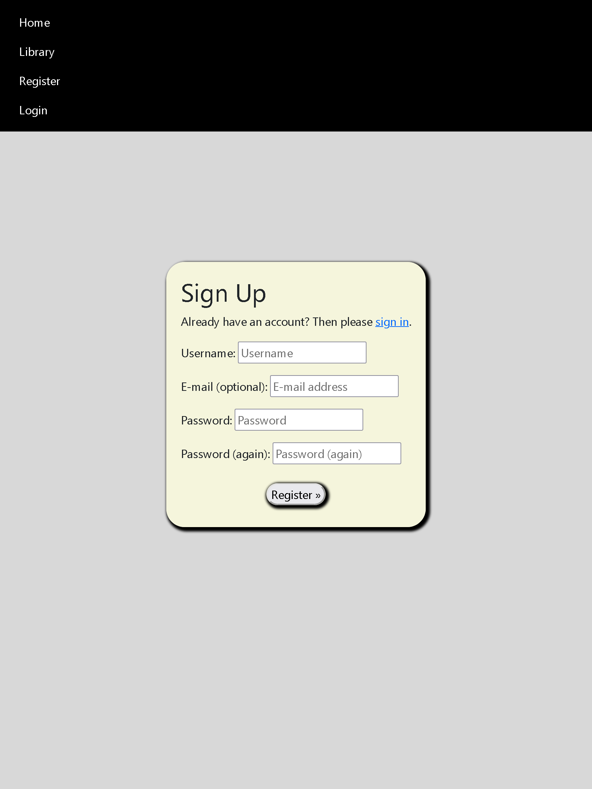
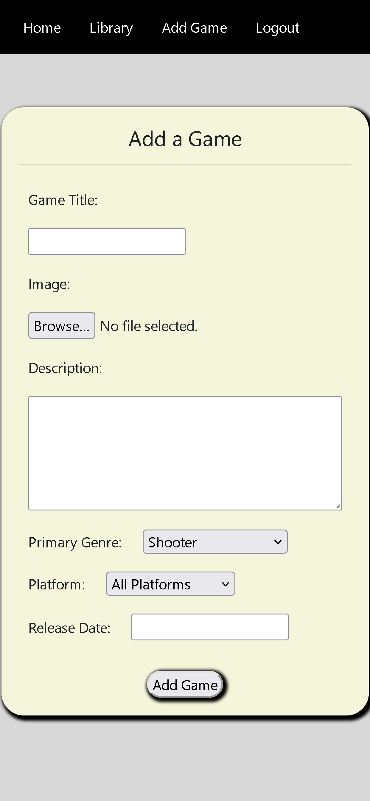